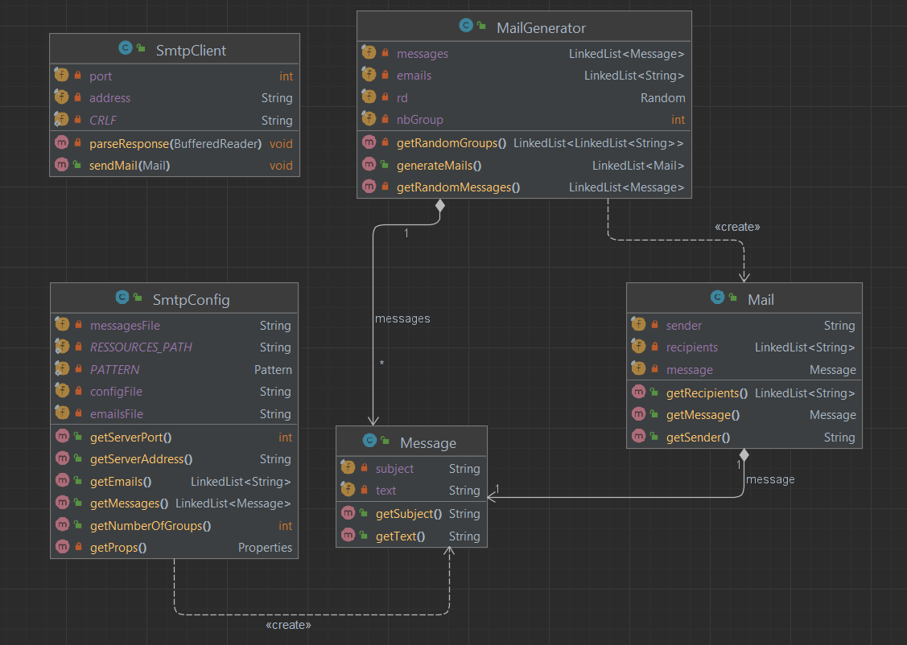

# DAI-2022-SMTP
## Description
The mission is to develop a client application that automatically plays pranks on a list of victims:

* The user should be able to **define a list of victims** (concretely,
you should be able to create a file containing a list of e-mail addresses).
* The user should be able to **define how many groups of victims should
be formed** in a given campaign. In every group of victims, there should
be 1 sender and at least 2 recipients (i.e. the minimum size for a group is 3).
* The user should be able to **define a list of e-mail messages**. When a prank
is played on a group of victims, then one of these messages should be selected.
**The mail should be sent to all group recipients, from the address of the group
sender**. In other words, the recipient victims should be lead to believe that the
sender victim has sent them.

## Project structure
    .
    ├── MockSMTPServer          # SMTP Server with all docker files
    ├── resources               # Configuration files for the project
    │   ├── config.properties   # Configuration of the SMTP server and the
    │   │                         the number of pranked groups 
    │   ├── email.utf8          # List of all emails
    │   └── messaages.utf8      # List of possible messages
    ├── src                     # Source files of prank project
    ├── pom.xml                 # Maven configuration file
    └── README.md

## MockMock 
_"MockMock is a cross-platform SMTP server built on Java. It allows you to test if
outgoing emails are sent (without actually sending them) and to see what they look
like. It provides a web interface that displays which emails were sent and shows you
what the contents of those emails are. If you use MockMock you can be sure that your
outgoing emails will not reach customers or users by accident. It really just is a
mock SMTP server and has no email sending functionality."_

The git link to the MockMock project is [here](https://github.com/tweakers/MockMock)

The following ways to create, run a mockmock instance, are meant to be executed on a Windows machine.

### Start mockmock with docker
To start the MockMock SMTP server in a docker container, you need to move in the ./MockSMTPServer folder.

To create the docker image run:

    > build-docker.bat

To run the docker image, that will expose to application on the port 8282 a website that show all email recieved by the SMTP server on port 25:

    > run-container.bat

### Start mockmock without docker
To start the MockMock SMTP server without docker you can run:

    > start-server.bat

## How to start and configure the prank project
In the resources folder at the root of the repository, multiple files are used to
configure the project. The 3 files must be in the resources folder for it to be able to run.

### Start the prank project
To start the prank project, you need to build the project using maven:

    > mvn clean install

And then start to start the project with:

    > java -jar .\target\DAI-2022-SMTP-1.0-SNAPSHOT.jar

---

### config.properties
The config.properties file is used to configure how to contact the SMTP
server and specify the number of group. The number of group must be greater than 0.

Default config (and example to edit):

    smtpServerAddress=localhost
    smtpServerPort=25
    numberGroups=1

---

### email.utf8
The email.utf8 file is used to list all emails separated by **\n** or **\r\n**.
The minimum number of emails in the file must be >= 3 * numberGroups in the config.properties
file. The minimum of 3 emails per group is mandatory to have 1 sender and at least 2 receivers.

Example of 3 emails in the file:

    rupak@sbcglobal.net
    ideguy@hotmail.com
    atmarks@yahoo.com

---

### messages.utf8
The messages.utf8 file is used to get a different mail body and subject for all groups.
The format of the message in the message.uft8 file:
    
    first line  # subject of the email
    all         # content of the email
    the 
    folowing 
    ///         # for spliting the email messages

Example of one message in the file:

    test0
    Because I could not stop for Death,
    He kindly stopped for me;
    The carriage held but just ourselves
    And Immortality.
    ///
    test0
    ...
---

## Description of the implementation

### SmtpConfig.java
This class is reading all the configurations to be able to send a prank message.
Retrieve all the emails of the people who will be pranked, all the messages that
can possibly be sent to the victims and the number of victims groups that will be
generated.
It will also read the configuration needed for the SmtpClient such as the port and
address of the server.

### Message.java
It's a simple class to create a message with its title and body text.

### Mail.java
It allows to create a mail with the sender, the recipients and the message to send.

### MailGenerator.java
This class will generate prank mails. The function generateMails() will create a
defined number of random groups and get a list of random messages to assign to each
group. This function return as many mails as the number of groups.

### SmtpClient.java
This class is used to send email via SMTP.
- **to complete**

### Discussion between the client and the MockMock SMTP server
    S: 220 PcTim.mshome.net ESMTP MockMock SMTP Server version 1.4\r\n
    C: EHLO test@test.com\r\n

    S: 250-PcTim.mshome.net\r\n
    S: 250-8BITMIME\r\n
    S: 250 Ok\r\n

    C: MAIL FROM:<test@test.com>\r\n
    S: 250 Ok\r\n

    C: RCPT TO:<test1@test1.com>\r\n
    S: 250 Ok\r\n

    C: RCPT TO:<test2@test2.com>\r\n
    S: 250 Ok\r\n

    C: DATA\r\n
    S: 354 End data with <CR><LF>.<CR><LF>\r\n

    C: Content-Type: text/plain; charset=utf-8\r\n
    C: From: test@test.com\r\n
    C: To: test1@test1.com, test2@test2.com\r\n
    C: Subject: =?utf-8?B?header test?=\r\n
    C: Now is the winter of our discontent\r\n
    C: .\r\n
    S: 250 Ok\r\n

    C: QUIT\r\n
    S: 221 Bye\r\n